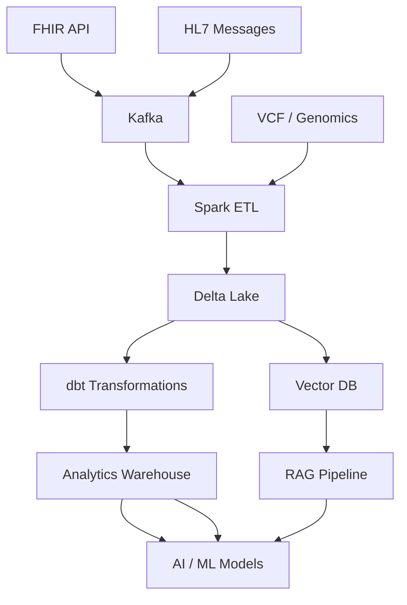

# Biomedical Data Platform

A senior-level data engineering portfolio project demonstrating end-to-end capabilities in **healthcare data engineering**, **genomics/bioinformatics pipelines**, and **AI/RAG systems**. Built with production-ready architecture, modern data engineering best practices, and professional documentation.

[](https://github.com/justin-mbca/biomedical-data-platform/actions)

---

## Table of Contents

- [Project Overview](#project-overview)
- [Architecture](#architecture)
- [Technology Stack](#technology-stack)
- [Repository Structure](#repository-structure)
- [Data Pipelines](#data-pipelines)
- [Installation Instructions](#installation-instructions)
- [Usage Examples](#usage-examples)
- [Example Workflow](#example-workflow)
- [Data Quality & Testing](#data-quality--testing)
- [Future Improvements](#future-improvements)

---

## Project Overview

The Biomedical Data Platform provides:

- **Healthcare data ingestion** — FHIR R4 → OMOP CDM via configurable pipelines
- **Genomics processing** — VCF variant calling, annotation, and clinical interpretation
- **RNA-Seq analysis** — Snakemake pipeline: QC, DESeq2, volcano plots
- **AI/RAG knowledge system** — Vector-store powered clinical decision support
- **Feature store** — Feast for ML feature management
- **Data quality** — Great Expectations (schema drift, null rate, freshness)
- **Orchestration** — Apache Airflow for pipeline scheduling

---

## Architecture

### System Data Flow



### High-Level View

```
┌─────────────────────────────────────────────────────────────────────────────┐
│                        BIOMEDICAL DATA PLATFORM                               │
├─────────────────────────────────────────────────────────────────────────────┤
│  Sources          │  Ingestion       │  Storage        │  Consumption       │
│  FHIR / HL7        │  Kafka/PubSub   │  Delta Lake     │  dbt Models        │
│  VCF / BAM         │  Spark ETL      │  Parquet        │  Feature Store     │
│  Clinical DBs      │  Airflow DAGs   │  Vector DB      │  ML Pipelines      │
└─────────────────────────────────────────────────────────────────────────────┘
```

See [architecture/system_architecture.md](architecture/system_architecture.md) and [docs/architecture/README.md](docs/architecture/README.md) for detailed diagrams.

---

## Technology Stack

| Category | Technology |
|----------|------------|
| **Languages** | Python, SQL, R |
| **Messaging** | Apache Kafka, GCP Pub/Sub |
| **Batch processing** | Apache Spark |
| **Storage** | Delta Lake, Parquet, PostgreSQL |
| **Orchestration** | Apache Airflow |
| **Transformation** | dbt |
| **Data quality** | Great Expectations |
| **Feature store** | Feast |
| **Vector DB** | Qdrant, pgvector |
| **Containerization** | Docker, Docker Compose |
| **IaC** | Terraform |
| **Orchestration (cloud)** | Kubernetes |
| **CI/CD** | GitHub Actions |

**Core stack:** Python · Apache Spark · Airflow · Delta Lake · Kafka · dbt · Great Expectations · Docker

---

## Repository Structure

```
biomedical-data-platform/
├── architecture/              # System architecture diagrams
├── docs/                      # Documentation
│   ├── architecture/         # Mermaid diagrams
│   ├── pipelines/             # Pipeline specs
│   └── data_models/           # FHIR, OMOP schemas
├── pipelines/
│   ├── fhir_pipeline/         # FHIR → OMOP ingestion
│   ├── fhir_ingestion/        # (implementation)
│   ├── genomics_pipeline/    # Variant processing
│   ├── genomics/             # (implementation)
│   ├── rna_seq/              # RNA-Seq QC, DESeq2
│   └── rag/                  # RAG knowledge pipeline
├── orchestration/
│   └── airflow/
│       └── dags/             # Airflow DAGs
├── data_models/
│   └── dbt/                  # dbt transformations
├── data_quality/
│   ├── great_expectations/   # GE expectation suites
│   └── run_validation.py     # Validation runner
├── ml/
│   ├── rag_pipeline/        # RAG pipeline entry
│   └── feature_repo/        # Feast definitions
├── infrastructure/
│   ├── docker/               # Dockerfile, docker-compose
│   ├── terraform/            # GCP/AWS IaC
│   └── kubernetes/           # K8s configs
├── notebooks/                # Example notebooks
│   ├── 01_pipeline_demo.ipynb
│   ├── 02_analytics_example.ipynb
│   └── 03_ml_training_example.ipynb
├── tests/                    # pytest
├── scripts/                  # Data generation, utilities
└── config/                   # Pipeline configuration
```

---

## Data Pipelines

| Pipeline | Description | Trigger |
|----------|-------------|---------|
| **FHIR Ingestion** | FHIR R4 → OMOP CDM → Delta/Parquet | Daily (Airflow) |
| **Genomics** | VCF → annotation → Parquet | On-demand |
| **RAG Index** | Guidelines → vector store | Weekly |
| **RNA-Seq** | Snakemake: QC → DESeq2 → volcano | On-demand |

---

## Installation Instructions

### Prerequisites

- Python 3.10+
- Docker & Docker Compose
- (Optional) Apache Spark 3.x, R, Snakemake

### Setup

```bash
# Clone
git clone https://github.com/justin-mbca/biomedical-data-platform.git
cd biomedical-data-platform

# Install Python dependencies
pip install -r requirements.txt

# Generate sample data
python scripts/generate_rna_seq_sample.py
python scripts/generate_synthetic_oncology.py

# Start infrastructure (Kafka, Postgres, Airflow)
cd infrastructure/docker && docker-compose up -d
# or: cd infrastructure && docker-compose up -d
```

---

## Usage Examples

### FHIR Ingestion

```bash
# Local bundle
python -m pipelines.fhir_ingestion.run --source config/sample_fhir_bundle.json

# HAPI FHIR server
python -m pipelines.fhir_ingestion.run --source "https://hapi.fhir.org/baseR4/Patient?_count=10"

# With config
python -m pipelines.fhir_ingestion.run --config config/fhir_demo.yaml
```

### Genomics Pipeline

```bash
python -m pipelines.genomics.variant_pipeline --input variants.vcf.gz --output data/genomics
```

### RAG Index

```bash
python -m pipelines.rag.build_index --sources docs/guidelines/ --output data/rag_index
```

### RNA-Seq (Snakemake)

```bash
cd workflows/snakemake && snakemake -j 2
```

### Analytics Dashboard

```bash
streamlit run apps/analytics_dashboard/app.py
```

### Data Quality

```bash
python data_quality/run_validation.py --data data/omop/person.parquet --suite person_suite
# Suites: person_suite, schema_drift_suite, null_rate_suite, data_freshness_suite
```

---

## Example Workflow

1. **Ingest FHIR data** → `python -m pipelines.fhir_ingestion.run --source config/sample_fhir_bundle.json`
2. **Validate** → `python data_quality/run_validation.py --data data/omop/person.parquet`
3. **Transform** → `cd data_models/dbt && dbt run`
4. **Explore** → Open `notebooks/02_analytics_example.ipynb`
5. **Dashboard** → `streamlit run apps/analytics_dashboard/app.py`

---

## Data Quality & Testing

### Great Expectations

- **Schema drift** — `schema_drift_suite.json`
- **Null rate validation** — `null_rate_suite.json`
- **Data freshness** — `data_freshness_suite.json`

### pytest

```bash
pytest tests/ -v
```

### dbt tests

```bash
cd data_models/dbt && dbt test
```

---

## Infrastructure as Code

- **Docker**: `infrastructure/docker/Dockerfile`, `docker-compose.yml`
- **Terraform**: `infrastructure/terraform/` (GCP example)
- **Kubernetes**: `infrastructure/kubernetes/airflow-deployment.yaml`

---

## Future Improvements

- [ ] Full Spark-based FHIR ingestion (scale to millions of resources)
- [ ] VEP/ANNOVAR integration for variant annotation
- [ ] MLflow for model tracking
- [ ] RBAC and audit logging for HIPAA compliance
- [ ] Real-time streaming with Kafka Connect
- [ ] Multi-cloud Terraform modules (AWS, Azure)

---

## Documentation

- [Architecture](architecture/system_architecture.md)
- [Setup Steps](docs/SETUP_STEPS.md) — Complete step-by-step setup guide
- [Real-World Data Integrations](docs/data_sources/REAL_WORLD_INTEGRATIONS.md) — Calico, Epic, TCGA, etc.
- [Knowledge Foundation](docs/knowledge/KNOWLEDGE_FOUNDATION.md)
- [Collaboration & Stakeholders](docs/knowledge/COLLABORATION_AND_STAKEHOLDERS.md)
- [Pipeline Specs](docs/pipelines/README.md)
- [Data Models](docs/data_models/README.md)
- [Setup Guide](docs/setup.md)
- [Source Repos](docs/source_repos.md)

---

## Author

**Justin Zhang** — [GitHub](https://github.com/justin-mbca) · [LinkedIn](https://www.linkedin.com/in/justinzh)

Data Scientist, Computational Biologist, Software Developer · Winnipeg, MB Canada

---

## License

MIT License — see [LICENSE](LICENSE).
