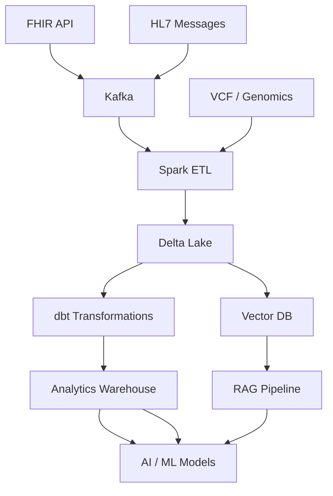
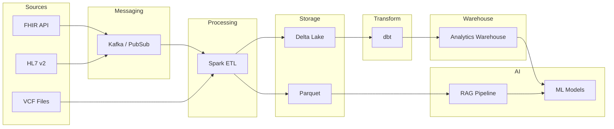

# System Architecture — Biomedical Data Platform

## Data Flow Diagram

```mermaid
graph TD
    A[FHIR API] --> B[Kafka]
    B --> C[Spark ETL]
    C --> D[Delta Lake]
    D --> E[dbt Transformations]
    E --> F[Analytics Warehouse]
    F --> G[AI / ML Models]
    
    H[VCF / Genomics] --> C
    I[HL7 Messages] --> B
    
    D --> J[Vector DB]
    J --> K[RAG Pipeline]
    F --> G
    K --> G
```

## Expanded View

```mermaid
flowchart LR
    subgraph Sources
        FHIR[FHIR API]
        VCF[VCF Files]
        HL7[HL7 v2]
    end
    
    subgraph Messaging
        Kafka[Kafka / PubSub]
    end
    
    subgraph Processing
        Spark[Spark ETL]
    end
    
    subgraph Storage
        Delta[Delta Lake]
        Parquet[Parquet]
    end
    
    subgraph Transform
        dbt[dbt]
    end
    
    subgraph Warehouse
        DW[Analytics Warehouse]
    end
    
    subgraph AI
        RAG[RAG Pipeline]
        ML[ML Models]
    end
    
    FHIR --> Kafka
    HL7 --> Kafka
    Kafka --> Spark
    VCF --> Spark
    Spark --> Delta
    Spark --> Parquet
    Delta --> dbt
    dbt --> DW
    DW --> ML
    Parquet --> RAG
    RAG --> ML
```
