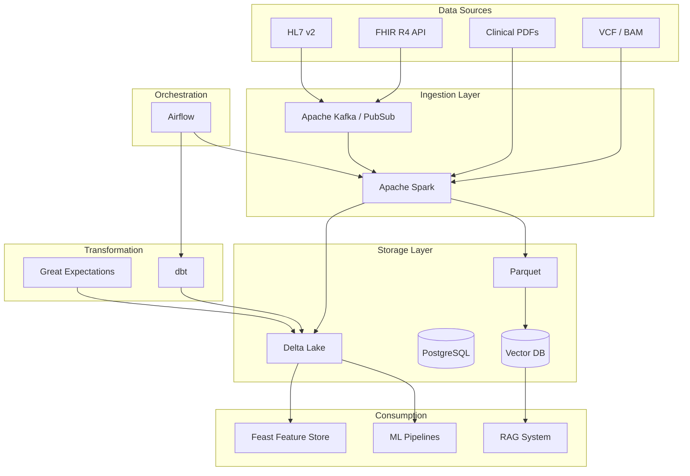
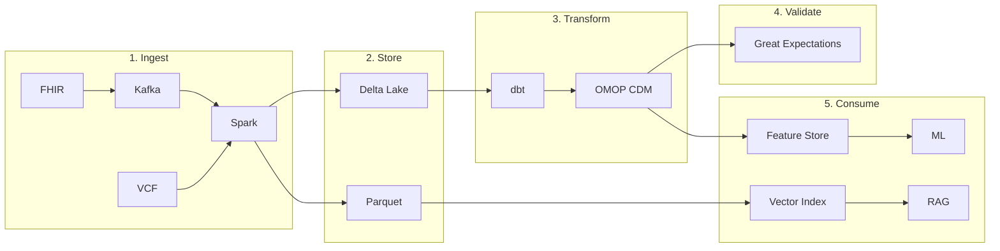
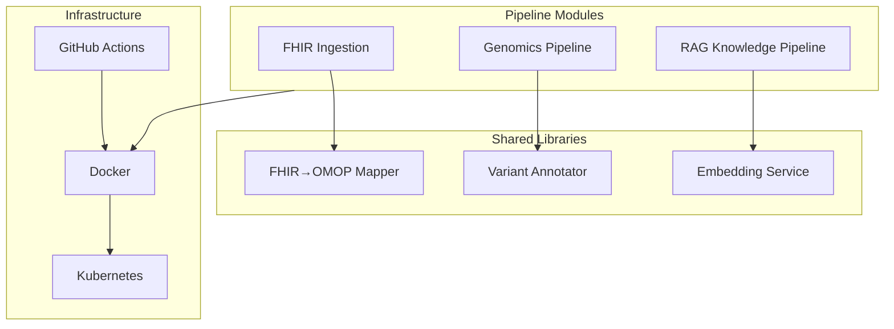
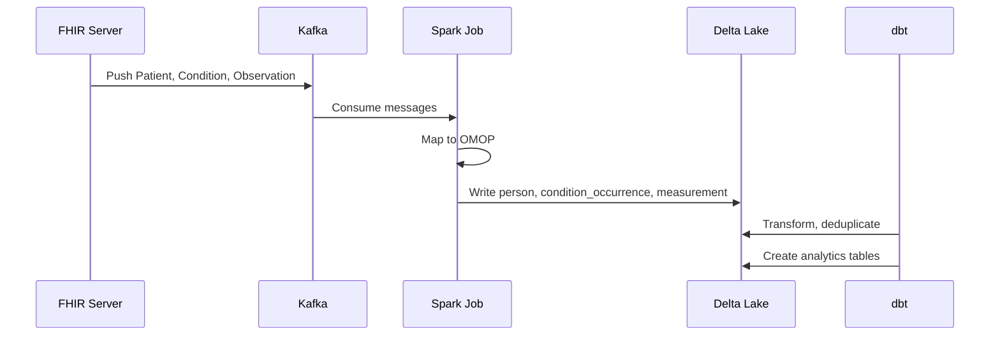

# Biomedical Data Platform — Architecture

## High-Level Architecture

## Data Flow

## Component Architecture

## FHIR → OMOP Pipeline

## Technology Choices

| Decision | Choice | Rationale |
|----------|--------|-----------|
| Messaging | Kafka | Decoupling, replay, scale; Pub/Sub for GCP |
| Batch | Spark | Unified engine for FHIR, VCF, large-scale ETL |
| Storage | Delta Lake | ACID, time travel, schema evolution |
| Orchestration | Airflow | DAG-first, rich ecosystem, healthcare adoption |
| Transformation | dbt | SQL-based, versioned, testable |
| Data quality | Great Expectations | Declarative expectations, profiling |
| Feature store | Feast | Online/offline, point-in-time correctness |
