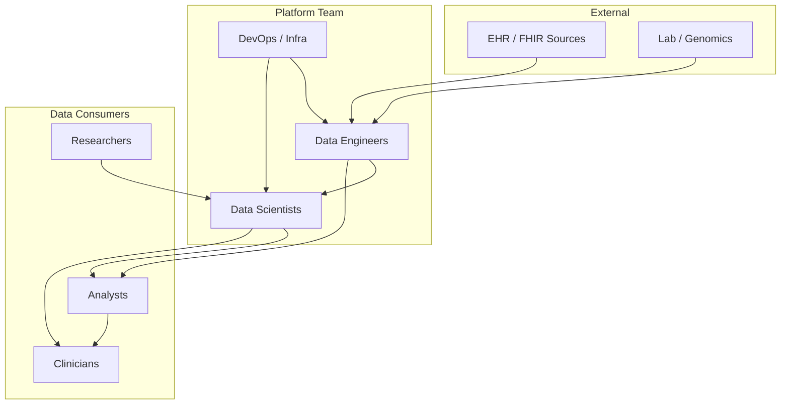

# Collaboration & Stakeholder Interaction

How teams, users, and groups interact with the Biomedical Data Platform. Use this for onboarding, access planning, and workflow design.

---

## 1. Stakeholder Overview



---

## 2. Roles & Responsibilities

| Role | Primary Interaction | Key Activities |
|------|---------------------|----------------|
| **Data Engineer** | Pipelines, orchestration, storage | Build/maintain FHIR, genomics, RAG pipelines; dbt models; data quality |
| **Data Scientist** | ML models, feature store, notebooks | Train models, define Feast features, RAG tuning, exploratory analysis |
| **Analyst** | dbt models, dashboards, warehouses | Create reports, cohort definitions, Streamlit dashboards |
| **Clinician** | Dashboards, RAG assistant | Query patient cohorts, clinical guidelines Q&A |
| **Researcher** | OMOP data, genomics outputs | Run cohort queries, variant analysis, export datasets |
| **DevOps / Platform** | Infrastructure, CI/CD, Airflow | Deploy services, manage Kafka, PostgreSQL, monitoring |

---

## 3. Interaction with the System

### Data Engineers

| System Component | Interaction |
|------------------|-------------|
| **FHIR Pipeline** | Configure source endpoints, extend OMOP mappings |
| **Airflow** | Author DAGs, monitor runs, adjust schedules |
| **dbt** | Add models, run `dbt run`, maintain `data_models/dbt/` |
| **Great Expectations** | Add expectation suites, run validation in CI |
| **Docker / Terraform** | Update `infrastructure/` configs |

**Workflow:** Code in `pipelines/`, `orchestration/`, `data_models/` → PR → CI runs tests → Merge → Airflow executes

### Data Scientists

| System Component | Interaction |
|------------------|-------------|
| **Notebooks** | `notebooks/` for exploration, feature engineering |
| **Feast** | Define feature views in `ml/feature_repo/` |
| **RAG Pipeline** | Add guidelines to `docs/guidelines/`, rebuild index |
| **ML Models** | Train in notebooks, log to MLflow, deploy via Airflow |

**Workflow:** Explore data → Define features → Train model → Register → Schedule inference DAG

### Analysts

| System Component | Interaction |
|------------------|-------------|
| **dbt** | Use staging/mart models for reports |
| **Streamlit** | Run `apps/analytics_dashboard/` for interactive views |
| **SQL** | Query OMOP via DuckDB, BigQuery, or warehouse |

**Workflow:** Query warehouse → Build dashboard or report → Share with clinicians/researchers

### Clinicians / Researchers

| System Component | Interaction |
|------------------|-------------|
| **Dashboards** | Streamlit for patient demographics, biomarker summaries |
| **RAG Assistant** | Ask questions over clinical guidelines |
| **Cohort Tools** | (Future) ATLAS-style cohort builder on OMOP |

**Workflow:** Access Streamlit app → Filter by cancer type, stage → Export or view insights

### DevOps / Platform Team

| System Component | Interaction |
|------------------|-------------|
| **Docker** | Build and run `infrastructure/docker/` |
| **Kubernetes** | Deploy Airflow, Kafka via `infrastructure/kubernetes/` |
| **Terraform** | Provision GCP/AWS resources |
| **CI/CD** | Maintain `.github/workflows/`, runners |

**Workflow:** Apply Terraform → Deploy containers → Monitor health → Scale as needed

---

## 4. Collaboration Workflows

### Requesting New Data Sources

```
Clinician / Analyst → Request → Data Engineer
                              → Add FHIR endpoint or VCF path to config
                              → Deploy pipeline
                              → Notify requester
```

### Adding a New dbt Model

```
Analyst / Data Scientist → Propose model → Data Engineer reviews
                                        → Add to data_models/dbt/models/
                                        → Run dbt test
                                        → Merge → Available in warehouse
```

### RAG Knowledge Update

```
Clinician / Content owner → Add markdown to docs/guidelines/
                          → Data Engineer or script triggers RAG index rebuild
                          → New content available in RAG assistant
```

### Incident / Data Quality Issue

```
Any user → Report anomaly → Data Engineer
                          → Check Great Expectations, Airflow logs
                          → Fix pipeline or expectation
                          → Re-run affected pipeline
```

---

## 5. Access & Permissions (Example)

| Role | Repo Access | Airflow | Data Warehouse | Dashboards |
|------|-------------|---------|----------------|------------|
| Data Engineer | Read/Write | Admin | Full | Full |
| Data Scientist | Read/Write | View, trigger | Full | Full |
| Analyst | Read | View | Query only | Full |
| Clinician | Read (optional) | — | De-identified only | View |
| Researcher | Read (optional) | — | De-identified, approved | View |
| DevOps | Read/Write | Admin | — | — |

*Adjust for your organization’s policies (e.g., IRB, HIPAA).*

---

## 6. Communication Channels

| Purpose | Channel (Example) |
|---------|-------------------|
| Pipeline failures | Slack/Teams alerts from Airflow |
| Data quality alerts | Great Expectations → Slack/Email |
| Feature requests | GitHub Issues |
| Documentation updates | PRs to `docs/` |
| Onboarding | Knowledge foundation + this doc |

---

## 7. GitHub Collaboration

| Action | Who |
|--------|-----|
| Open issues | Any team member |
| Propose changes | Data Engineers, Data Scientists |
| Review PRs | At least one Data Engineer |
| Merge to main | After CI passes + review |
| Release / tag | DevOps or lead |

**Branching:** `main` (production), `develop` (integration), feature branches.
